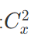
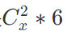

## A.难搞的物理题
判断合力是否为0，只需判断x,y,z三个坐标轴上的分力全为0，即可。
```c
#include <stdio.h>
int main()
{
    int n;
    scanf("%d", &n);
    int x, y, z;
    x = y = z = 0;
    while(n --){
        int a, b, c;
        scanf("%d %d %d", &a, &b, &c);
        x += a;
        y += b;
        z += c;
    }
    if(x == 0 && y == 0 && z == 0) puts("YES");
    else puts("NO");
    return 0;
}
```
## B.奇妙的排序
有长度为n的排列，里面元素1到n，我们每次可以任选两个元素交换，问最少交换多少次可以使得前k个元素最小。
要使前k个元素最小，那么前k个元素就是1到k，我们将原来排列中前k个数里大于k的元素与后面的小于k的数进行交换就好了。
也就是，记录前k个数中大于k的元素的个数。
```c
#include <stdio.h>
#define N 101

int n, k, t;
int a[N];

int main()
{
    scanf("%d", &t);
    while (t --)
    {
        scanf("%d %d", &n, &k);
        for (int i = 0; i < n; i ++) 
            scanf("%d", &a[i]);
        int ans = 0;
        for (int i = 0; i < k; i ++){
            if(a[i] > k) ans ++;
        }    
        printf("%d\n", ans);
    }

    return 0;
}
```
## C.车厢的重新排序
本题每次只能交换相邻的元素，使数组由小到大排序。
我们选择使用冒泡排序，记录交换次数即可。
```c
#include <stdio.h>
#define swap(a, b) {int t = a; a = b; b = t;}
#define N 10001

int n;
int a[N];

int main()
{
    scanf("%d", &n);
    for (int i = 0; i < n; i ++)
        scanf("%d", &a[i]);
    int ans = 0;
    for (int i = 0; i < n; i ++)
        for (int j = 0; j < n - i - 1; j ++)
            if(a[j] > a[j + 1]){
                swap(a[j], a[j + 1]);
                ans ++;
            }
    printf("%d", ans);
    return 0;
}
```

## D.遗忘的密码
题目给我们没有使用的密码的个数n，我们可以得到可能使用的密码的个数**10 - n**, 我们设为**x**。
已知每个密码由两种数字组成，显然可得每两种数字可以组成6种密码。
同时，我们可以使用的数字个数是**x**, 每次从中选取两个数字组成密码。
可选择的组合有:

又每两个数字能组成6种密码。

综上可得，答案是
```c
#include <stdio.h>
#define N 10

int n, t;
int a[N];

int main()
{
    scanf("%d", &t);
    while(t --){
        scanf("%d", &n);
        for (int i = 0; i < n; i ++)
            scanf("%d", &a[i]);
        int ans = 0;
        int x = 10 - n;
        ans = x * (x - 1) / 2 * 6;
        printf("%d\n", ans);
    }
    return 0;
}
```
## E. 阿尼亚学数学
要求按1 + ... + 2 + ... + 3 + ...这种形式输出。
那么我们记录1，2，3的个数，与+交替输出即可。
```c
#include <stdio.h>
#include <string.h>
int main()
{
    char str[100];
    scanf("%s", str);
    int a[4] = {0};
    for (int i = 0; i < strlen(str); i ++){
        if(str[i] == '1') a[1] ++;
        else if(str[i] == '2') a[2] ++;
        else if(str[i] == '3') a[3] ++;
    }
    for (int i = 1; i <= 3; i ++){
        if(a[i] > 0){
            printf("1");
            a[i] --;
            break;
        }
    }
    for (int i = 1; i <= 3; i ++){
        while(a[i] --){
            printf("+%d", i);
        }
    }
    return 0;
}
```
## F.筛质数
暴力解：
- 可用判断素数方法得到大部分分数。
既先判断一个数是不是素数，若是，则计数加一。

正解：
- 任意整数 x 的倍数 2x，3x，… 等都不是质数 。
- 所以我们通过已经判断出的质数来不停更新后面的合数。
```c
#include <stdio.h>
#include <stdbool.h>
#define maxn 100000007
bool st[maxn];
int primes[maxn];
int main(){
    int n, cnt = 0;
    scanf("%d", &n);
    for(int i = 2; i <= n; i ++){
        if(!st[i]){ // 若是质数，存入prime数组中
            primes[cnt ++]=i;
            for(int j = i; j <= n; j += i) 
                st[j]=true; // st[i]若为true，则表示i为合数
            //可以用质数就把所有的合数都筛掉；
        }
    }
    printf("%d\n", cnt);
    return 0;
}
```


## G.a + b
直接输出就好
```c
#include <stdio.h>

int main()
{
    int a, b;
    scanf("%d %d", &a, &b);
    printf("%d", a + b);
    return 0;
}
```

## H.打印等腰直角三角形
第几行就输出几个星星
```c
#include <stdio.h>

int main()
{
    int n;
    scanf("%d", &n);
    for (int i = 1; i <= n; i ++){
        for (int j = 1; j <= i; j ++)
            printf("*");
        puts("");
    }
    return 0;
}
```